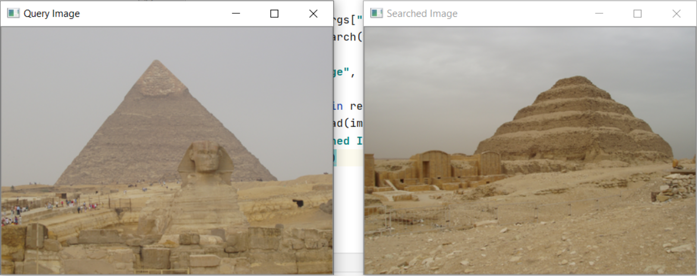
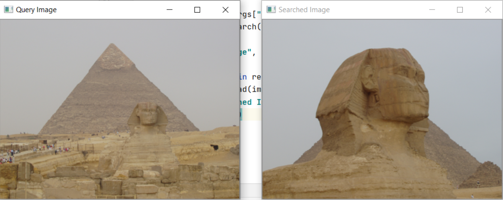
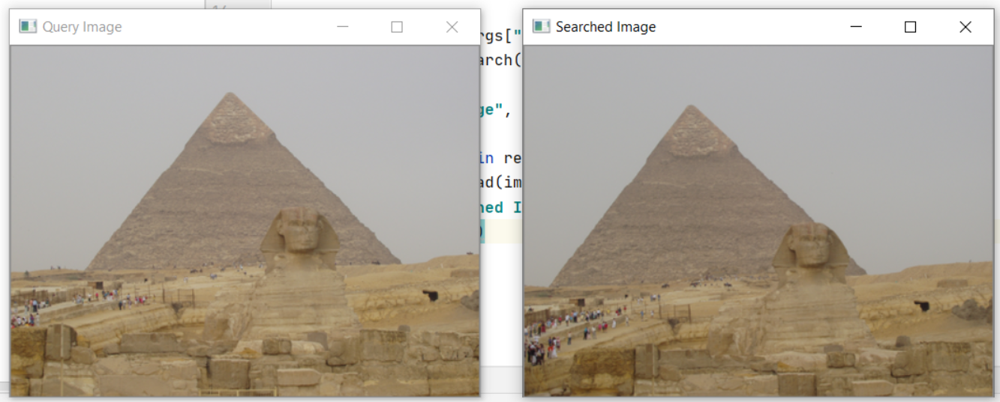
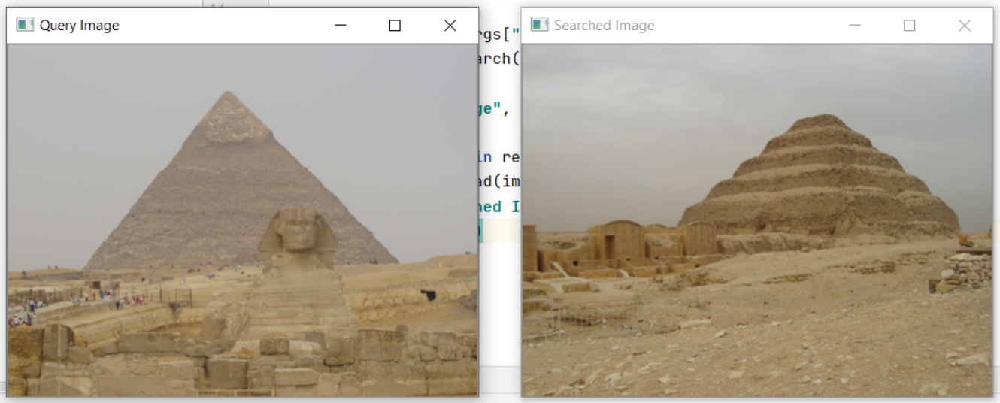
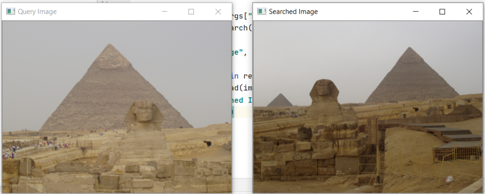
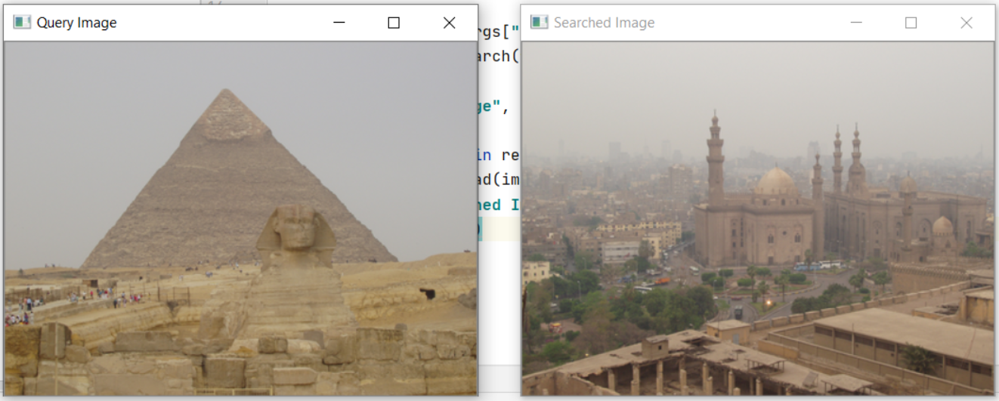
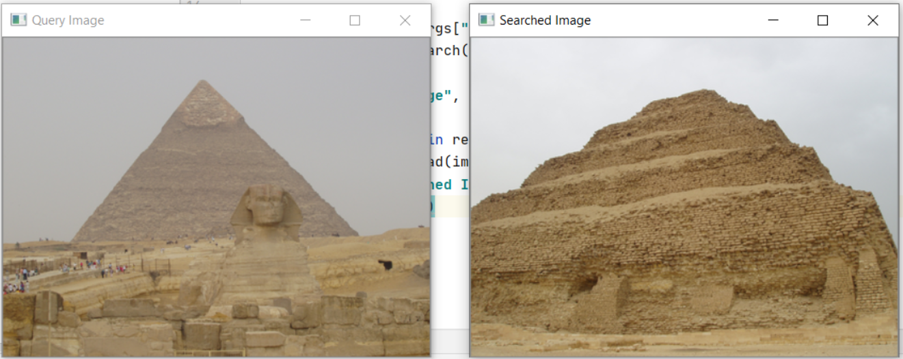
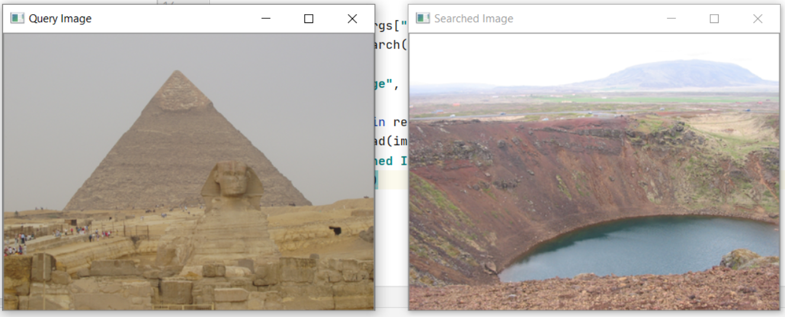

# Image-Search-Engine Using Python and OpenCv

Imagine a folder full of random photos and you want those specific photos you took of the pretty skies a year ago. We generally don’t name or give a tag to all our photos, so what would you do ? Searching through all the photos will be time taking and you will probably end up leaving the work without completing it. Instead of this why don’t we just leave the work of searching to the system itself? Yes, you read that right searching for images by using an image. This is what is called an Image Search Engine. Just as in word search engines, you give a reference word/phrase and you get results based on it, an image search engine uses image as a reference to find other related images. There are various methods to implement this. After going through multiple algorithms, one stood out to us the most. Our algorithm is inspired by pyimagesearch's-The complete guide to building an image search engine with Python and OpenCV. Let us see what are the various steps to implement Image Search Engine.

Four distinct steps used:

1. Image descriptor:
Color descriptor tells how we quantify the image. 
Whether we want to learn the features of an image on the basis of color or shape of the object or texture.
Here we have done using a 3D color histogram in HSV color space with bins as - Hue channel,Saturation channel, value channel. In our code the value of these bins are - (8,12,3)

2. Indexing:
After defining the method of extracting features from the image we apply the image descriptor on all the images of the dataset so as to extract the features and then save them cumulatively under a csv file called “index.cv”.
We have used INRIA Holidays Dataset for this project of Image search engine using Python and OpenCv.

3. Defining your similarity metric:
After extracting and storing the features, we compare them. Here we have used the Chi-square test. Chi - square test is used to find dependencies between categorical variables.

4. Searching: 
After comparing the features we move forward with performing actual search. An argument is passed in the terminal as a query which fetches the image with similar features from the csv and displays those images as “searched image” to the “query image”.

A few output images - 

